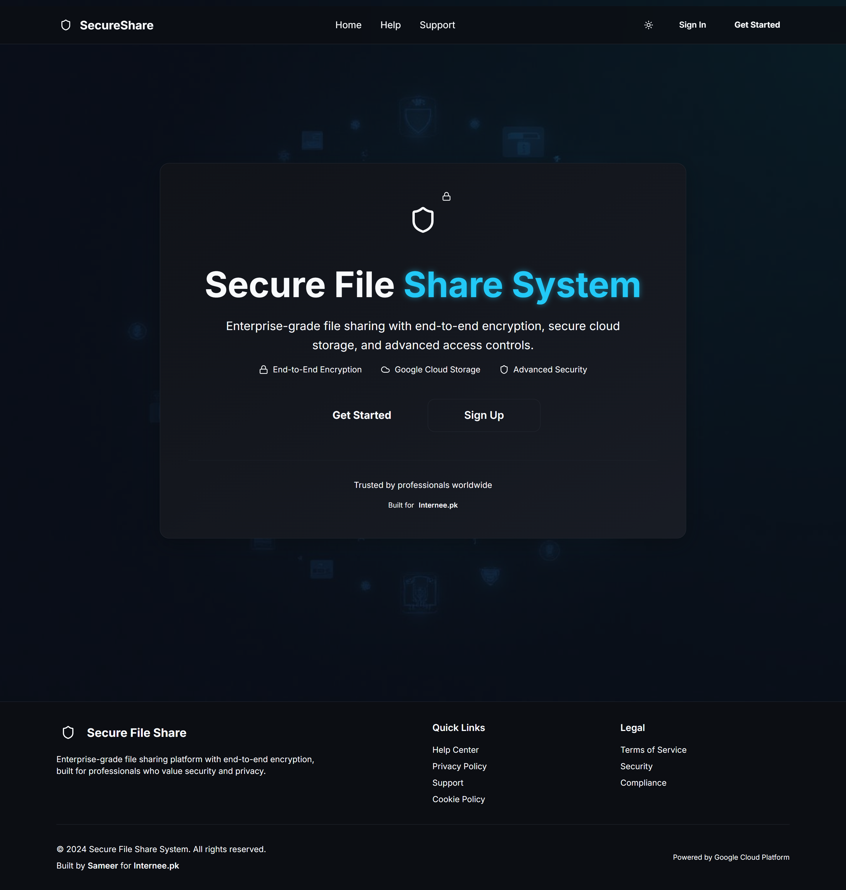
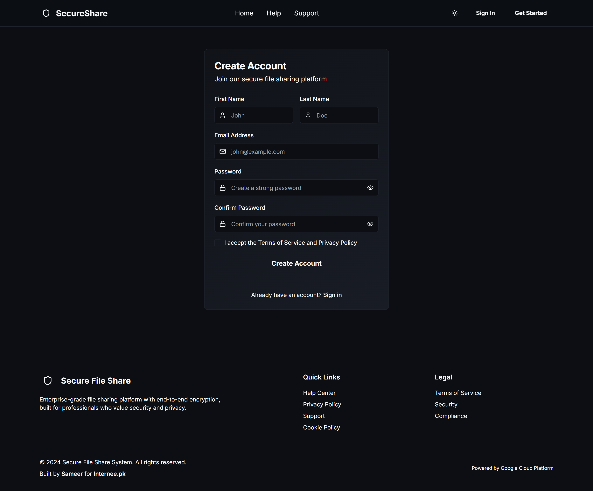
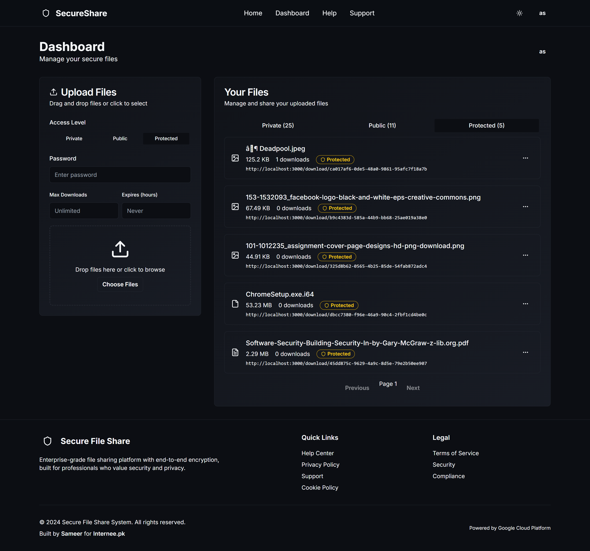
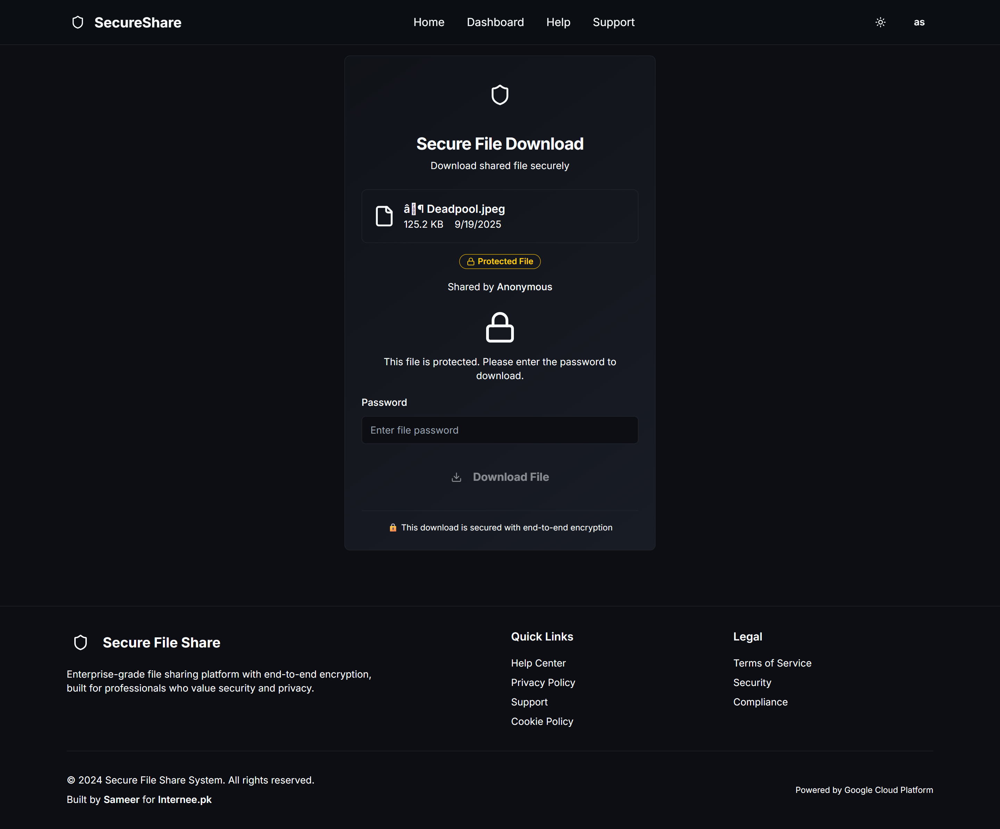

# Secure File Sharing System

A secure, feature-rich file sharing system built with React, TypeScript, , and GCP Firebase integration.


[](LICENSE)


---

## 📑 Table of Contents
- [📖 Overview](#-overview)
- [✨ Features](#-features)
- [🛠 Tech Stack](#-tech-stack)
- [📂 Project Overview](#project-overview)
- [📁 Complete Project Tree Structure](#complete-project-tree-structure)
- [🖼 Screenshots](#-screenshots)
- [☁️ Google Cloud Storage & Firebase Setup](#google-cloud-storage--firebase-setup)
  - [Database Tables](#tables)
  - [Storage Setup](#storage)
  - [Backend API Endpoints](#backend-api-endpoints)
  - [Edge Function Environment Variables](#2--edge-functions-environment-variables)
  - [Firebase Setup Steps](#firebase-setup-steps)
  - [⚙️ Development Setup](#development-setup)
  - [Prerequisites](#prerequisites)
  - [Installation Steps](#installation-steps)
  - [VSCode Extensions (Recommended)](#vscode-extensions-recommended)
- [🔐 Security Features](#-security-features)
- [📁 File Management](#-file-management)
- [🎯 Access Control](#-access-control)
- [📊 Analytics & Monitoring](#-analytics--monitoring)
- [🎨 User Experience](#-user-experience)
- [🚀 Production Deployment](#production-deployment)
  - [⚙️ Configuration](#-configuration)
  - [Firebase Configuration](#firebase-configuration)
  - [Frontend Deployment](#frontend-deployment)
- [🔒 Security Considerations](#security-considerations)
  - [Development](#development)
  - [Production](#production)
- [📚 Support & Documentation](#support--documentation)
- [🤝 Contributing](#contributing)
- [📄 License](#license)


---
## 📖 Overview
**Secure File Sharing System** is a full-stack web application designed for **safe, password-protected file sharing**.  
Built with a modern tech stack and security best practices, it provides an intuitive interface for users to upload, share, and download files securely.

---

## ✨ Features
✅ **Password-Protected Sharing** – Restrict access with secure links  
✅ **Download Tracking** – Monitor who downloaded what  
✅ **Secure Backend** – Encryption for files & passwords  
✅ **Responsive Frontend** – Works on desktop & mobile  
✅ **User Authentication** – Signup/Login support  

---

## 🛠 Tech Stack
| Layer        | Technology |
|-------------|-----------|
| **Frontend** | React, Tailwind CSS |
| **Backend** | Node.js, Express.js |
| **Database** | MongoDB |
| **Other** | GCP Storage (Optional), JWT, Bcrypt |

---

## Project Overview

This is a comprehensive secure file sharing platform that allows users to upload, share, and manage files with three levels of access control:

- **Private**: Only the owner can access
- **Public**: Anyone with the link can access
- **Protected**: Password-protected access

## Complete Project Tree Structure

```
# 📂 Project Structure – Secure File Sharing System

```bash
secure-file-sharing-system/               # 🚀 Main Project Folder
├── 📄 .gitignore                        # Files & folders Git should ignore
├── 📄 bun.lockb                         # Bun lock file (dependency versions)
├── 📄 README.md                         # Project documentation
│
├── 📂 Backend                           # 🖥️ Node.js + Express API (Server Side)
│   ├── 📂 config                        # ⚙️ Environment & Firebase configs
│   │   ├── env.js                      # Environment variable loader
│   │   └── firebase.js                 # Firebase SDK setup
│   │
│   ├── 📂 controllers                   # 🎯 Business logic & request handlers
│   │   ├── auth.js                     # Auth & JWT logic
│   │   ├── files.js                    # File upload/download logic
│   │   └── users.js                    # User management APIs
│   │
│   ├── 📂 middleware                    # 🛡️ Express middlewares
│   │   ├── auth.js                     # JWT auth middleware
│   │   └── upload.js                   # File upload handling (Multer)
│   │
│   ├── 📂 routes                        # 🌐 API endpoints
│   │   ├── auth.js                     # /auth endpoints
│   │   ├── files.js                    # /files endpoints
│   │   └── users.js                    # /users endpoints
│   │
│   ├── 📂 src                           # 🏗️ TypeScript entry
│   │   └── index.ts                    # App bootstrap / entry point
│   │
│   ├── 📂 utils                         # 🧰 Helper functions
│   │   └── formatFileSize.js           # Converts file sizes to human-readable
│   │
│   ├── 📄 .env                          # 🔑 Environment variables
│   ├── 📄 Google Auth client secrets.json # Google OAuth client secrets
│   ├── 📄 service-account-key.json      # Firebase Admin SDK key
│   ├── 📄 package.json                  # Backend dependencies & scripts
│   ├── 📄 package-lock.json             # Dependency lock file
│   └── 📄 server.js                     # Main Express server file
│
├── 📂 Frontend                          # 🎨 React + Vite (Client Side)
│   ├── 📂 dist                          # 🏁 Production build output
│   │   ├── 📂 assets                    # Static bundled assets
│   │   ├── 📄 favicon.ico              # Favicon
│   │   ├── 📄 index.html               # Built HTML
│   │   ├── 📄 placeholder.svg          # Placeholder image
│   │   └── 📄 robots.txt               # SEO / crawler rules
│   │
│   ├── 📂 public                        # 🌍 Public assets (copied as-is)
│   │   ├── favicon.ico
│   │   ├── placeholder.svg
│   │   └── robots.txt
│   │
│   ├── 📂 src                           # 🖌️ Application source code
│   │   ├── 📂 assets                   # Images, icons, static resources
│   │   │   └── hero-bg.jpg
│   │   │
│   │   ├── 📂 components               # Reusable UI components
│   │   │   ├── 📂 ui                  # 🧩 ShadCN UI components
│   │   │   │   ├── accordion.tsx      # Collapsible panels
│   │   │   │   ├── alert-dialog.tsx   # Modal alerts
│   │   │   │   ├── ...                # Many other UI components (buttons, menus)
│   │   │   ├── Footer.tsx             # Site footer
│   │   │   ├── Hero.tsx               # Hero section
│   │   │   ├── Navbar.tsx             # Navigation bar
│   │   │   ├── ProtectedRoute.tsx     # Auth-based route protection
│   │   │   └── ThemeToggle.tsx        # Dark/Light mode switch
│   │   │
│   │   ├── 📂 hooks                    # (Optional) Custom React hooks
│   │   ├── 📂 integrations             # API integrations
│   │   ├── 📂 lib                      # Utility functions / libraries
│   │   ├── 📂 pages                    # React pages / routes
│   │   │
│   │   ├── App.css                    # Global styles
│   │   ├── App.tsx                    # Root React component
│   │   ├── index.css                  # Tailwind CSS imports
│   │   ├── main.tsx                   # App entry point
│   │   └── vite-env.d.ts              # TypeScript env types
│   │
│   ├── 📄 .env                         # 🔑 Frontend environment variables
│   ├── 📄 index.html                   # Development HTML entry
│   ├── 📄 package.json                 # Frontend dependencies & scripts
│   ├── 📄 package-lock.json            # Dependency lock file
│   ├── 📄 postcss.config.cjs           # PostCSS config
│   ├── 📄 tailwind.config.js/ts        # Tailwind CSS config
│   ├── 📄 tsconfig*.json               # TypeScript configurations
│   └── 📄 vite.config.ts               # Vite configuration

```
## 🖼 Screenshots
Here’s a quick preview of the app:  

| Page | Screenshot |
|------|------------|
| **Home** |  |
| **Login** |  |
| **Signup** |  |
| **Dashboard** |  |
| **Download Page** |  |
| **Support Center** |  |
| **Help Center** |  |
| **Privacy Policy** |  |

> 🖌 **Tip:** You can replace these screenshots anytime by updating the files in the `screenshots/` folder.

---

## Google Cloud Storage & Firebase Setup 

### Tables

1. **profiles**

   - User profile information
   - Linked to  Auth users
   - Auto-created on user registration

2. **files**

   - File metadata and access control
   - Three access levels: private, public, protected
   - Download limits and expiration support
   - Password protection for protected files

3. **download_logs**
   - Track all file downloads
   - IP address and user tracking
   - Analytics and monitoring

### Storage

- **Bucket**: `files` (private by default)
- **Structure**: `{user_id}/{unique_filename}`
- **Access Control**: Via RLS policies and Edge Functions

## Backend API Endpoints

All endpoints are implemented as  Edge Functions:

## 🔌 API Endpoints (summary)
- `POST /functions/v1/upload-file` — Upload file (auth required)  
- `POST /functions/v1/download-file` — Download file (auth or password depending on access)  
- `GET  /functions/v1/file-info` — Get file metadata  
- `GET  /functions/v1/user-files` — Get files for current user (auth required)  
- `POST /functions/v1/delete-file` — Delete file (auth required)

---

### 1. File Upload (`/functions/v1/upload-file`)

- **Method**: POST
- **Auth**: Required
- **Body**:
  ```json
  {
    "file": "base64_encoded_file",
    "fileName": "document.pdf",
    "mimeType": "application/pdf",
    "accessLevel": "public|private|protected",
    "password": "optional_password",
    "maxDownloads": 10,
    "expiryHours": 24
  }
  ```

### 2. File Download (`/functions/v1/download-file`)

- **Method**: POST
- **Auth**: Optional (depends on access level)
- **Body**:
  ```json
  {
    "fileId": "uuid",
    "password": "optional_password"
  }
  ```

### 3. File Info (`/functions/v1/file-info`)

- **Method**: GET
- **Auth**: Optional
- **Query**: `?fileId=uuid`

### 4. User Files (`/functions/v1/user-files`)

- **Method**: GET
- **Auth**: Required
- **Query**: `?page=1&limit=10`

### 5. Delete File (`/functions/v1/delete-file`)

- **Method**: POST
- **Auth**: Required
- **Body**:
  ```json
  {
    "fileId": "uuid"
  }
  ```

## GCP Firebase Integration Setup

### Required Environment Variables

Update these files for GCP Firebase integration:

#### 1. `.env` file (Frontend)

```env
#  Configuration (Already configured)
VITE__PROJECT_ID="kuphzxrquhwfkcljvkse"
VITE__PUBLISHABLE_KEY="your__anon_key"
VITE__URL="https://kuphzxrquhwfkcljvkse..co"

# GCP Firebase Configuration (Add these)
VITE_FIREBASE_API_KEY="your_firebase_api_key"
VITE_FIREBASE_AUTH_DOMAIN="your_project.firebaseapp.com"
VITE_FIREBASE_PROJECT_ID="your_firebase_project_id"
VITE_FIREBASE_STORAGE_BUCKET="your_project.appspot.com"
VITE_FIREBASE_MESSAGING_SENDER_ID="your_sender_id"
VITE_FIREBASE_APP_ID="your_app_id"
```

#### 2.  Edge Functions Environment Variables

Add these secrets via  Dashboard → Project Settings → Functions:

```bash
# GCP Firebase Admin SDK
FIREBASE_PROJECT_ID="your_firebase_project_id"
FIREBASE_PRIVATE_KEY="your_firebase_private_key"
FIREBASE_CLIENT_EMAIL="your_firebase_client_email"

# GCP Storage Bucket
GCP_STORAGE_BUCKET="your_storage_bucket_name"
```

### Firebase Setup Steps

1. **Create Firebase Project**:

   - Go to [Firebase Console](https://console.firebase.google.com/)
   - Create new project
   - Enable Authentication and Storage

2. **Get Configuration**:

   - Project Settings → General → Your apps
   - Add web app and copy config

3. **Service Account**:

   - Project Settings → Service Accounts
   - Generate new private key
   - Save JSON file securely

4. **Storage Rules**:
   ```javascript
   rules_version = '2';
   service firebase.storage {
     match /b/{bucket}/o {
       match /{allPaths=**} {
         allow read, write: if request.auth != null;
       }
     }
   }
   ```

## Development Setup

### Prerequisites

- Node.js 18+ (or use [nvm](https://github.com/nvm-sh/nvm))
- npm or bun
- VSCode (Optional)

### Installation Steps

1. **Clone the repository**:

   ```bash
   git clone <your_git_url>
   cd secure-file-sharing-system
   ```

2. **Install dependencies**:

   ```bash
   npm install
   # or
   bun install
   ```

3. **Environment Setup**:

   - Copy `.env.example` to `.env`
   - Update with your  and Firebase credentials

4. **Database Setup**:

   - Database migration has been run automatically
   - Check  Dashboard to verify tables are created

5. **Start development server**:
   ```bash
   npm run dev
   # or
   bun dev
   ```

### VSCode Extensions (Recommended)

Install these extensions for optimal development experience:

```json
{
  "recommendations": [
    "bradlc.vscode-tailwindcss",
    "ms-vscode.vscode-typescript-next",
    "esbenp.prettier-vscode",
    "ms-vscode.vscode-eslint",
    ".",
    "formulahendry.auto-rename-tag",
    "ms-vscode.vscode-json",
    "chakrounanas.turbo-console-log"
  ]
}
```

## Key Features

### 🔐 Security Features

- Row Level Security (RLS) policies
- JWT authentication via  Auth
- Password protection for files
- IP tracking and audit logs
- File encryption at rest

### 📁 File Management

- Drag & drop file upload
- Multiple file format support
- File size limits and validation
- Automatic file cleanup
- Download limits and expiration

### 🎯 Access Control

- **Private**: Owner-only access
- **Public**: Shareable links
- **Protected**: Password-protected downloads

### 📊 Analytics & Monitoring

- Download tracking
- User analytics
- Storage usage monitoring
- Audit logs

### 🎨 User Experience

- Dark/light theme support
- Responsive design
- Progressive Web App (PWA) ready
- Toast notifications
- Loading states and error handling

## Production Deployment

### ⚙️ Configuration

1. Set up production  project
2. Configure environment variables
3. Set up custom domain (optional)
4. Configure CORS settings

### Firebase Configuration

1. Set up production Firebase project
2. Configure storage rules
3. Set up monitoring and analytics

### Frontend Deployment

- Deploy via 's built-in deployment
- Configure custom domain if needed
- Set up CDN for static assets

## Security Considerations

### Development

- Environment variables are properly configured
- Database has RLS enabled
- All sensitive operations go through Edge Functions

### Production

- Enable 2FA on all admin accounts
- Regular security audits
- Monitor download patterns
- Set up alerting for suspicious activity

## Support & Documentation

- ** Docs**: [https://.com/docs](https://.com/docs)
- **Firebase Docs**: [https://firebase.google.com/docs](https://firebase.google.com/docs)
- **React Docs**: [https://react.dev](https://react.dev)
- **Tailwind CSS**: [https://tailwindcss.com](https://tailwindcss.com)

## Contributing

1. Fork the repository
2. Create feature branch
3. Make changes and test
4. Submit pull request

## License

This project is licensed under the @Sameer Lab's License.
